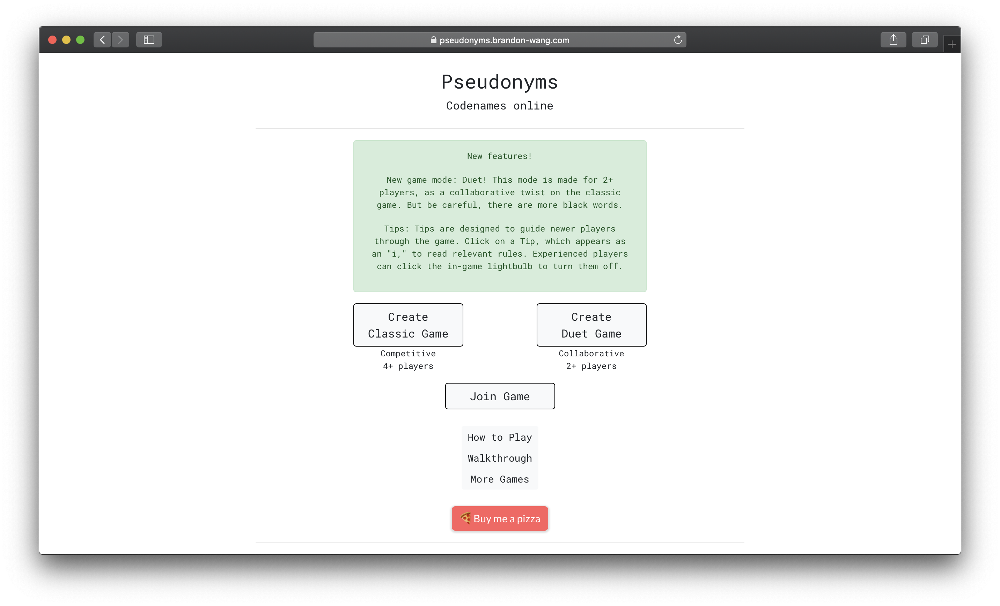
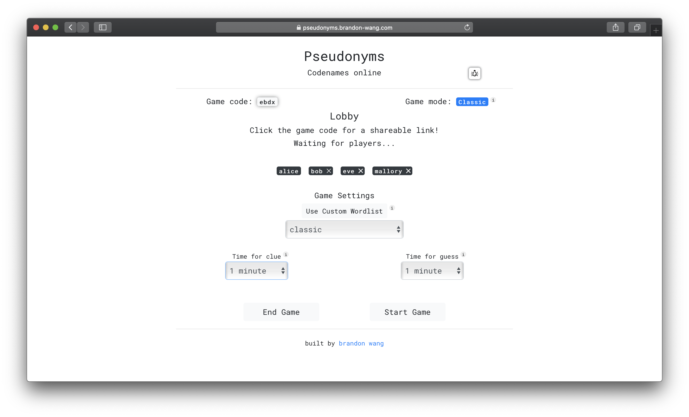
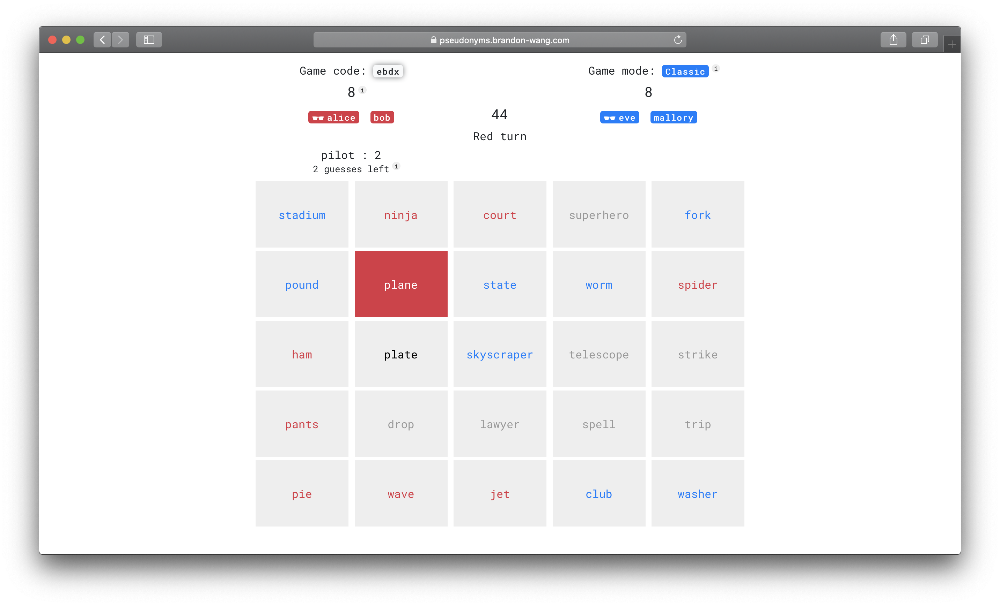

# Pseudonyms

Pseudonyms is an online version of the popular party game Codenames. 
This app was created to add more features that existing online Codenames games did not have, such as custom wordlists, private rooms, cheating prevention. 
[Try it out!](https://pseudonyms.brandon-wang.com/)

    
    
    

### Features

- Duet mode: collaborative version of the game
- Tips scattered around the game to guide newer players
- Private rooms with shareable links
- Custom wordlists
- Adjustable time limit
- Randomized team selection
- Players can't cheat by switching roles or using `Inspect Element`